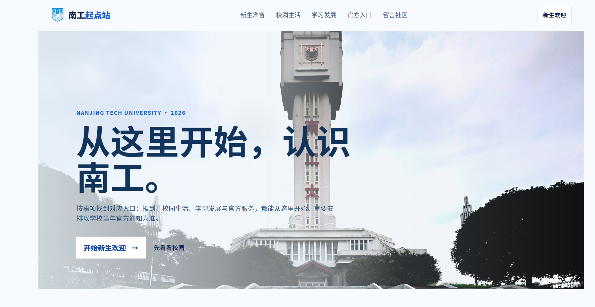
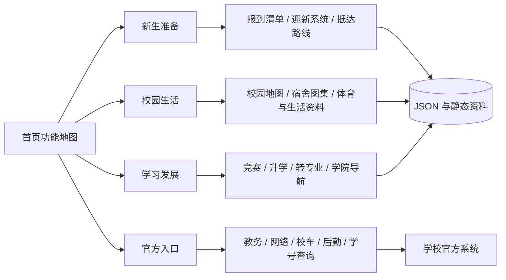

  

<h1 align="center">南工起点站</h1>

南京工业大学新生信息导航

  <a href="https://njtechstart.top/"><strong>访问正式网站</strong></a>
  &nbsp;·&nbsp;
  <a href="https://z-y-m-123.github.io/njtech-freshman-2026/"><strong>访问 GitHub Pages 镜像</strong></a>
  &nbsp;·&nbsp;
  <a href="#访问说明">查看访问说明</a>

> 报到准备、校园探索、官方服务与成长信息，在一个清晰入口里完成。

## 为什么做这个网站

新生第一次进入大学，通常需要在迎新系统、学院通知、后勤页面、地图和各种零散资料之间反复切换。信息并不是不存在，而是分散、难检索、缺少场景化说明，导致“知道有入口，却不知道该从哪里开始”。

南工起点站的目标，是把南京工业大学新生最常遇到的任务整理成一张易于理解的功能地图：出发前看报到清单和抵达路线，到校后查校园地图、宿舍和生活资料，需要办理正式业务时直达学校官方系统，入学后还可以继续使用学院导航、竞赛、转专业和升学专题。

项目重点不只是“做出一个页面”，而是尝试把真实的新生使用场景转化为一个可以持续更新的校园信息产品。

## 技术栈

南工起点站采用不依赖大型前端框架的轻量技术方案，降低访问门槛，也方便后续维护和迁移：

| 层次 | 使用技术 | 主要用途 |
| --- | --- | --- |
| 页面结构 | HTML5 | 多页面信息架构、语义化内容和官方入口组织 |
| 视觉样式 | 原生 CSS、CSS Variables、响应式布局 | 蓝色校园视觉、卡片组件、主题切换和移动端适配 |
| 交互逻辑 | 原生 JavaScript（ES Modules） | 搜索、筛选、折叠、清单勾选、地图图层和专题渲染 |
| 数据组织 | JSON 与 JavaScript 数据模块 | 报到资料、校园点位、竞赛、转专业和学院信息的结构化管理 |
| 地图能力 | Leaflet、百度地图/全景 API | 校园点位、高清地图图层和可选的全景浏览 |
| 内容资源 | JPG、PNG、WebP、PDF、XLSX | 校园地图、宿舍图片、校历、竞赛资料和公开信息附件 |
| 运行环境 | 静态托管 | 无需构建服务即可部署，适合手机快速访问 |
| 正式部署 | 腾讯云 CloudBase 静态托管 | 提供 `njtechstart.top` 正式站和 HTTPS 访问 |
| 镜像部署 | GitHub Pages | 提供公开演示、项目宣传和离线镜像入口 |
| 质量验证 | Node.js、`node --check`、自定义测试脚本 | 检查脚本语法、页面链接、资料完整性和镜像一致性 |

项目刻意将需要账号登录的迎新、教务、学号查询等业务交回学校官方系统，本站负责导航、解释和资料整理；百度地图密钥使用域名白名单限制，云端凭据和本地配置不会放入公开仓库。

## 网站架构

南工起点站采用轻量的静态站点架构，优先保证新生在手机上快速打开、按任务找到入口，并把需要身份认证的操作交回学校官方系统。

### 分层说明

- **页面层**：HTML 页面按用户任务拆分为首页、新生准备、校园生活、学习发展和官方入口，避免把所有内容堆在一个页面中。
- **样式层**：使用原生 CSS 和响应式布局，统一蓝色校园视觉、卡片边界、移动端单列布局与浅色/深色主题能力。
- **交互层**：使用原生 JavaScript 实现搜索、分类筛选、清单勾选、地图图层、宿舍图片查看、专题数据渲染和移动端安全降级。
- **内容层**：`data/` 保存结构化资料，`assets/` 保存校历、地图、宿舍、升学和竞赛附件；页面不伪造学校登录系统。
- **地图层**：校园地图使用 Leaflet 展示校区点位，高清图提供宿舍与生活图层；百度全景按需加载，失败时保留外部导航兜底。
- **官方服务层**：迎新系统、学号查询、教务、网络、图书馆和后勤服务均跳转学校官方入口，站内只做分类、说明和检索。
- **部署层**：`njtechstart.top` 使用腾讯云 CloudBase 静态托管，仓库的 `gh-pages` 分支提供 GitHub Pages 镜像；两者共用同一套静态发布文件。
- **资源边界**：留言功能暂时关闭，避免云函数和数据库运行消耗；历史数据保留，后续可以通过配置开关恢复。

### 目录约定

| 路径 | 用途 |
| --- | --- |
| `index.html` | 首页功能地图与常用入口 |
| `freshman-welcome.html`、`arrival-checklist.html` | 新生欢迎、报到准备与抵达信息 |
| `campus-map.html`、`campus-tools.html` | 地图、宿舍图层、校园生活资料和体育项目 |
| `services.html`、`academic-directory.html` | 官方服务检索与学院官网导航 |
| `competitions.html`、`advancement.html`、`transfer.html` | 学习发展专题 |
| `data/`、`assets/` | 可复用的结构化数据和原始资料 |
| `gh-pages` 分支 | GitHub Pages 静态镜像，不包含云函数和本地密钥 |

## 从这里出发

南工起点站是一份面向南京工业大学新生的实用导航。它不把信息堆成一张长清单，而是把真实会遇到的场景整理成清晰入口：出发前知道该准备什么，到校后用地图认路，需要办事时直达官方服务，入学之后也能继续探索校园与成长信息。

## 功能地图

### 入学前：把准备工作一次理清

- **报到清单**：按“必带、到校可买、谨慎携带”整理行李与材料，减少遗漏。
- **报到与抵达**：查看南京站、南京南站、禄口机场等抵达方式，以及到江浦校区的路线参考。
- **校历与关键日期**：集中查看新生报到、军训、寒暑假和学期节点；具体安排以学校通知为准。
- **新生资料库**：将报到清单、宿舍、转专业、社团和常用电话分栏展示，支持分类切换、内容折叠和资料下载。

### 到校后：先认识校园，再处理日常事务

- **高清校园地图**：查看江浦校区建筑、校门、食堂、宿舍和校医院；支持宿舍图层、生活图层、缩放和点位说明。
- **宿舍信息**：按东苑、西苑、南苑、象山、檀香、亚青等区域查看宿舍说明，并进入对应图片图集。
- **宿舍图集**：从地图或宿舍介绍进入图片查看器，集中浏览房间、楼栋和公共空间参考图。
- **校园电话簿**：把维修、网络、校医院、校园安全等常用电话集中列出，减少在页面间来回查找。
- **主题切换**：网站支持浅色与深色模式，适应白天浏览和夜间查资料。

### 官方服务：需要办事时直接到正确入口

- **官方入口搜索**：按关键词或类别查找教务、报到学籍、生活后勤、资助安全等入口。
- **课表 / 空教室查询**：直达南京工业大学教务系统登录页，不在站内伪造学校系统。
- **网络服务**：提供校园上网用户自服务入口，并保留网络故障处理电话。
- **校车信息**：直达后勤部门发布的校车班次与说明页面。
- **学院官网与培养方案**：按学院和学科方向整理官网、通知公告和培养方案入口。
- **竞赛目录**：浏览学科竞赛与创新创业竞赛目录，并提供 Excel、PDF 等资料入口。

### 学业与成长：入学之后继续用得上

- **转专业专题**：单独整理普通本科生方案、流程、答疑、先修课与笔试信息；退役大学生士兵等特殊通道独立标注，避免和普通生源混淆。
- **社团目录**：按社团中心和类别浏览详细名单，而不是只看概括性介绍。
- **升学去向**：按学院查看公开的升学、推免、统考与出国（境）等记录，并保留“仅供参考”的数据说明。
- **竞赛与创新**：按竞赛级别、牵头单位和关键词筛选赛事，支持查看详情及资料下载。
- **官方资讯图片**：部分升学榜单提供“查看图片”和对应公众号原文入口，方便核对原始内容。

### 同学之间：留下真实的校园经验

- **精选留言**：展示南工起点站的精选语录与新生经验。
- **留言社区**：当前暂未开放发布和读取，以减少运行资源消耗；历史数据和相关页面结构保留，后续可按需恢复。
- **安全提醒**：留言内容与资料均需自行甄别，重要政策、时间和名额以学校官方发布为准。

## 页面与交互细节

| 页面 | 用户能做什么 | 适合什么时候打开 |
| --- | --- | --- |
| 首页 | 从“报到准备、抵达校园、官方查询、遇见同学”四条路径进入；可切换深浅色主题。 | 第一次打开网站时。 |
| 新生资料库 | 按报到清单、宿舍、转专业、社团、电话入口筛选；长内容可折叠，附件放在对应条目后下载。 | 出发前集中查资料时。 |
| 高清校园地图 | 在宿舍与生活图层间切换，缩放拖拽地图，点击宿舍、食堂、校门、校医院等点位查看说明。 | 到校前认路，或到校后找地点时。 |
| 宿舍图片查看器 | 从宿舍介绍或地图侧栏打开图片集合，不覆盖原有文字说明。 | 分配宿舍后了解生活环境时。 |
| 官方入口查询 | 搜索“迎新、课表、校车、网络、资助”等词，也可按教务学习、报到学籍、生活后勤、资助安全筛选。 | 需要进入学校系统或核验正式流程时。 |
| 2026 迎新系统入口 | 直达学校迎新系统，说明通知公告、信息采集、到站登记、报到单、资助等模块分别处理什么。 | 收到学校迎新通知后。 |
| 转专业专题 | 查看普通方案的院系条目、计划、先修课程、笔试/面试与流程提醒；特殊通道独立呈现。 | 产生转专业想法后，不要等到报名期才查。 |
| 社团目录 | 由社团中心展开到详细名单，避免只给笼统介绍。 | 开学招新季或想找同好时。 |
| 竞赛目录 | 用关键词、竞赛等级和牵头单位筛选；查看赛事详情和相关 PDF / Excel 资料。 | 规划创新创业或学科竞赛时。 |
| 升学去向 | 按学院查公开荣誉榜和原始图片，区分升学、推免、统考与出国（境）信息。 | 选专业、了解学院发展方向时。 |
| 学院导航 | 从学部进入学院官网、通知公告与培养方案入口。 | 查询本专业课程、学分和学院通知时。 |
| 校历 | 浏览 2026 - 2027 学年校历，标记报到、军训、假期等关键日期。 | 安排行程、购票或规划假期时。 |
| 留言社区 | 当前显示功能状态说明，历史数据不删除。 | 后续恢复开放后用于查看经验与反馈。 |

## 为什么不是“信息大杂烩”

网站把每类内容放在最适合的形式里：地图负责空间信息，专题页负责需要反复筛选的转专业、竞赛和升学信息，官方入口只做可信跳转与流程提示，资料库则承担可下载的原始材料。这样既能快速找到答案，也不会把重要事项做成不可靠的站内“替代系统”。

## 内容状态与边界

- 站内已整理的内容会标注资料性质，例如公开资料、往年参考或站内专题。
- 迎新系统、教务、缴费、学籍、资助申请等需要身份认证的操作，始终跳转学校官方页面完成。
- 不公开旧二维码、账号规则、云端配置、数据管理后台或网站实现代码。
- 网站适合导航和核对信息，不替代学校通知、学院通知或辅导员的正式说明。

## 在需要的时候打开

**还没出发**：先看要带什么、怎么到校、抵达之后优先做什么。

**刚到校园**：从宿舍、地图和常用服务入口开始熟悉环境。

**开始上课**：通过官方入口继续查询课表、网络和校内事务。

**想多了解一点**：再去看看社团、竞赛、转专业、升学和校园生活信息。

## 信息使用原则

- **官方优先**：涉及选课、学籍、缴费和其他重要事务时，始终以学校官方系统和通知为准。
- **按需整理**：优先保留新生真正会用到的信息与入口，减少不必要的跳转。
- **轻量访问**：手机打开也能快速找到目的地，不要求安装额外应用。
- **持续更新**：内容会结合实际使用反馈逐步完善；具体时间、政策和名额请以学校最新通知为准。

## 访问说明

项目提供两个访问入口：

- 正式站：[https://njtechstart.top/](https://njtechstart.top/)
- GitHub Pages 镜像：[https://z-y-m-123.github.io/njtech-freshman-2026/](https://z-y-m-123.github.io/njtech-freshman-2026/)

GitHub Pages 镜像使用仓库的 `gh-pages` 分支发布，页面、资料和图片与正式站保持同步。

技术问题咨询：微信号 `happzhu_ai_EAI`
